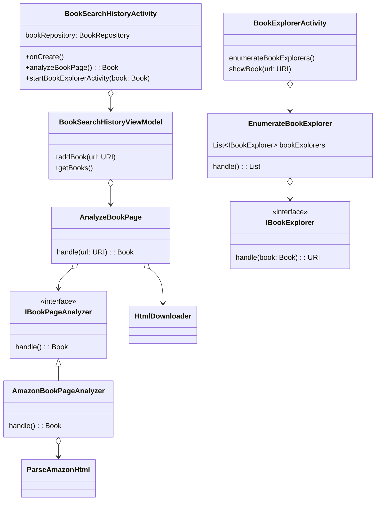

```mermaid
classDiagram

class BookSearchHistoryActivity {
	bookRepository: BookRepository
	+onCreate()
	+analyzeBookPage(): Book
	+startBookExplorerActivity(book: Book)
}

class BookExplorerActivity {
	enumerateBookExplorers()
	showBook(url: URI)
}


class AnalyzeBookPage {
	handle(url: URI): Book
}

class IBookPageAnalyzer {
	<<interface>>
	handle(): Book
}

class AmazonBookPageAnalyzer {
	handle(): Book
}

class IBookExplorer {
	<<interface>>
	handle(book: Book): URI
}

class EnumerateBookExplorer {
	List~IBookExplorer~ bookExplorers
	handle(): List<IBookExplorer>
}

class BookSearchHistoryViewModel {
	+addBook(url: URI)
	+getBooks()
}

BookSearchHistoryActivity o--> BookSearchHistoryViewModel
BookSearchHistoryViewModel o--> AnalyzeBookPage

BookExplorerActivity o--> EnumerateBookExplorer

AnalyzeBookPage o--> HtmlDownloader
AnalyzeBookPage o--> IBookPageAnalyzer

IBookPageAnalyzer <|-- AmazonBookPageAnalyzer
AmazonBookPageAnalyzer o--> ParseAmazonHtml

EnumerateBookExplorer o--> IBookExplorer

```